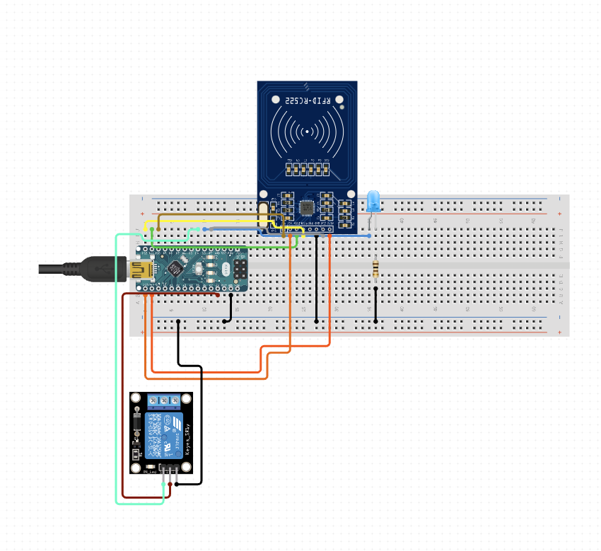

# Escape Room Timer with RFID Disarm

## Overview
This project is an Arduino-based countdown timer designed for an escape room scenario. It uses an RFID reader to either stop the timer or indicate unauthorized access. The countdown is displayed on an LCD, and an LED is used to provide visual feedback based on the RFID interaction and the countdown completion.

## Features
- **10-Minute Countdown Timer**: The timer starts at 10 minutes and counts down, displaying the remaining time on an LCD.
- **RFID Reader Integration**: The timer can be stopped by presenting a known RFID card.
- **LED Indicators**:
  - **Authorized Card**: An LED turns on when the correct card is detected, stopping the countdown.
  - **Unauthorized Card**: A different LED flashes to indicate an unauthorized card.
  - **Timer End**: The authorized card LED flashes when the timer reaches zero.

## Hardware Requirements
- Arduino board (e.g., Uno, Mega)
- MFRC522 RFID module
- LiquidCrystal LCD (16x2)
- LEDs for visual indicators
- Relay module (optional, if connecting to additional external hardware)
- Jumper wires
- Breadboard

## Wiring Diagram

- **RFID Module**:
  - `SS_PIN (10)` -> Digital pin 10
  - `RST_PIN (9)` -> Digital pin 9
  - `SDA_PIN` and `SCL_PIN` for SPI communication
- **LCD**:
  - Connect to pins 2, 3, 4, 5, 6, and 7 for data and control
- **LEDs**:
  - **Authorized Card LED**: Connect to pin A0
  - **Unauthorized Card LED**: Connect to pin 8

## Code Walkthrough
- **Setup**:
  - Initializes the LCD, RFID reader, and sets up LED pins.
  - Starts a 10-minute countdown timer.
- **Loop**:
  - Displays the remaining time on the LCD and prints it to the Serial Monitor every minute.
  - Checks for an RFID card; if a known card is detected, stops the timer and lights the authorized LED.
  - If the timer reaches zero, flashes the authorized LED 10 times.
- **RFID Functions**:
  - `readRFID()`: Reads the RFID card and determines if it matches the stored UID.
  - `printDec()`: Prints the UID of the card to the Serial Monitor.
  - `printUnlockMessage()`: Displays "Unlocked" on the LCD if the correct card is presented.
  - `flashLed()`: Flashes the authorized LED 10 times when the timer ends.

## Usage
1. **Power the Arduino** and ensure all connections are secure.
2. The timer will automatically start at 10 minutes.
3. Present an RFID card:
   - If the card is known (matches the stored UID), the timer will stop, and the authorized LED will turn on.
   - If the card is unknown, the unauthorized LED will flash, and "Card Not Allowed" will be displayed.
4. **When the timer ends**, the authorized LED will flash 10 times.

## Notes
- Ensure the RFID card's UID matches the stored value in the code (`int code[] = {203, 158, 65, 2};`).
- The LCD will display the time remaining in minutes and seconds.
- The project can be adapted for different timer values by changing the `COUNTDOWN_TIME` constant.

## Images
- **RFID Module Setup**: 
- **Wiring**: 
- **RFID codes**: 

## License
This project is open source and free to use for non-commercial purposes. Contributions and modifications are encouraged.
